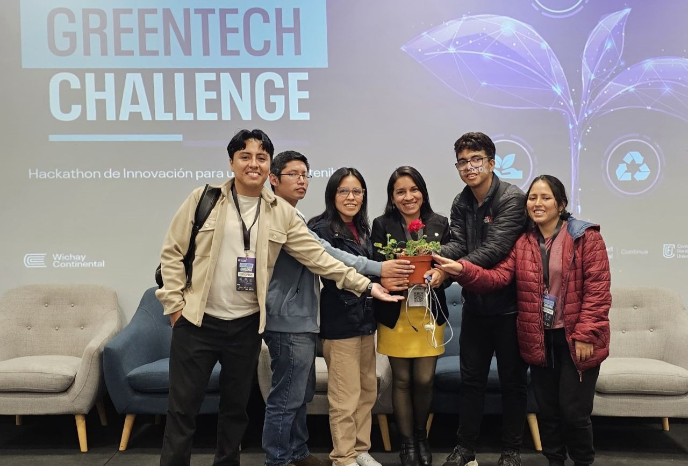
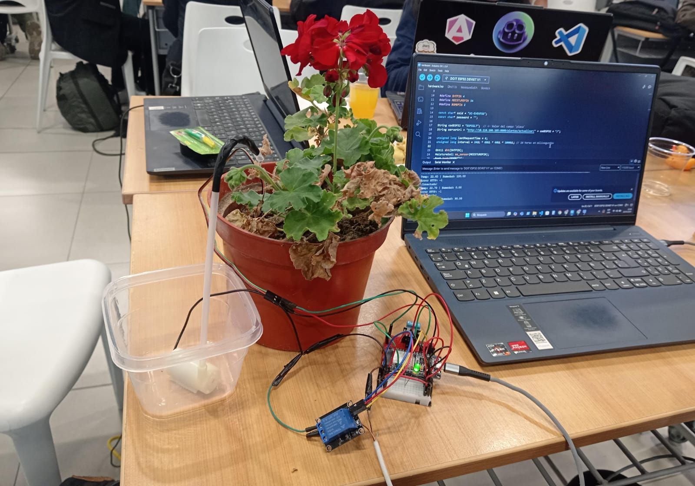
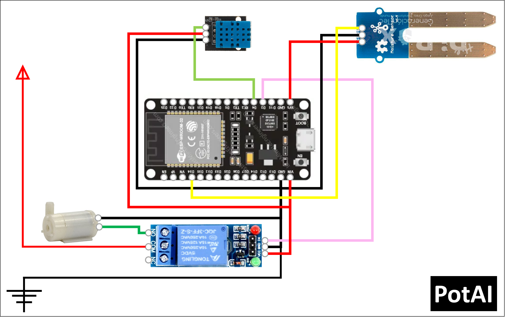

# 🌱 PotAI – AI & IoT-based Water-Efficient Plant Care

Welcome to **PotAI**, an intelligent and sustainable plant watering system powered by **Artificial Intelligence (AI)** and the **Internet of Things (IoT)**. This project is designed to minimize water usage by determining the exact amount of water a plant needs, based on real-time environmental data.

## 👥 Contributors

- Asthri Pardave [AsthriPardave](https://github.com/AsthriPardave)
- Giacomo Madrid [GiacomoMadrid](https://github.com/GiacomoMadrid)
- Laura Mendoza [LauraNotFound](https://github.com/LauraNotFound)
- Luis La Torre [AdminLTR](https://github.com/adminLTR)
- Samir Garcia [SamirSG7](https://github.com/SamirSG7)
- **Mentor**: [Yanina Renteria](https://www.linkedin.com/in/yaninagiron/?midToken=AQGr0w-OWF7Vkg&midSig=2apvAusf1AEXM1&trk=eml-email_jobs_job_application_viewed_01-members_from_company-0-profile_name&trkEmail=eml-email_jobs_job_application_viewed_01-members_from_company-0-profile_name-null-kgsm7z~mb75hpct~30-null-null&eid=kgsm7z-mb75hpct-30&otpToken=MTMwNzFkZTcxNzJkY2JjMWIwMmQwZmViNDExYWVmYjc4N2M2ZDc0MzlkYTg4ODYyN2JjZjAyNmI0YjVkNTVmMWZmZDVkNWU5NmJiNWM4ZGE1MDlhZjJiNjAyNmE3YTVjZDNjYTVmOWI1NmVlNzljZTFmYjg5YjM2LDEsMQ%3D%3D)

## 🚀 Project Overview

PotAI is a smart pot system that:

- **Analyzes multiple inputs** such as:
  - Plant type
  - Soil moisture
  - Air temperature and humidity
  - Light intensity
- **Calculates the optimal amount of water** (in milliliters) for the plant
- **Automatically waters** the plant using a water pump
- **Continuously monitors** plant conditions and only waters again when needed
- **Provides a user-friendly interface** to:
  - Visualize real-time data
  - Manage multiple plants or pots (multi-plant support)

---

## 🧠 How It Works

1. **Data Collection**: Sensors gather environmental data.
2. **Intelligent Processing**: An AI model determines the plant’s water needs based on current conditions.
3. **Irrigation**: A water pump dispenses the exact amount of water required.
4. **Visualization**: A visual interface shows all relevant metrics to the user in real time.
5. **Multiple Plants**: The system supports managing several plants at once.

---

## 📦 Features

- 🌡️ Real-time monitoring of temperature, humidity, and light
- 🌱 Support for different plant species with tailored care
- 💧 Smart irrigation algorithm that minimizes water usage
- 📊 Mobile dashboard for live plant status and control
- 🔁 Automated irrigation cycles with fail-safe logic
- 🪴 Multi-pot scalability for home or small garden setups

---

## 🛠️ Technologies Used

- **ESP32** (Microcontroller for IoT integration)
- **Soil Moisture Sensor**, **DHT Sensor**, **Light Sensor**
- **AI Model** for water requirement prediction
- **Water Pump** controlled via relay
- **Frontend**: (HTML, CSS, JS, Bootstrap)
- **Backend**: (Django, PostgreSQL)

---

## 🌍 Sustainability Impact

PotAI contributes to **SDG 6 – Clean Water and Sanitation** and **SDG 12 – Responsible Consumption and Production** by optimizing water usage in everyday gardening.

---

## 📷 Demo / Screenshots

  
  
  

---
